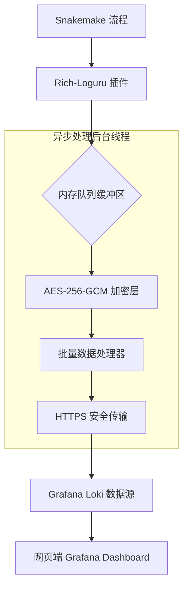

# Snakemake Logger 增强插件：Rich-Loguru

这是一个基于 Loguru 和 Rich 开发的 Snakemake 日志插件，旨在为生物信息学流程提供极度舒适的终端输出、结构化的本地记录，以及基于 Grafana Loki 的远程可视化监控。

## 🌟 核心特性

- 华丽的终端输出：利用 Rich 库优化 Snakemake 运行状态，支持进度条展示和规则高亮。
- 结构化本地日志：Loguru 驱动，支持自动滚动、多级别记录（JSON 或文本）。
- Grafana Loki 深度整合：支持将分析流程实时推送到 Web 端，通过 Grafana 仪表盘监控任务进度。
- 金融级加密传输：远程日志支持 AES-256-GCM 端到端加密，确保敏感路径和样本信息不泄露。
- 异步非阻塞架构：日志发送由独立线程（Async Worker）处理，在高并发生信任务下依然保持零性能损耗。
- 统一分析环境：提供简单的 API，让你的 Python 脚本、Rust 工具与 Snakemake 共享同一套日志配置。

## 🏗 技术架构



### 核心组件说明：

- **队列缓冲区**：即使集群网络波动，日志也会暂存在内存中，不会阻塞 Snakemake 任务执行。
- **加密层**：在数据离开内网前完成加密，保护科研数据安全。
- **远程观测**：不仅是日志，更是监控。支持在网页端查看任务耗时分布、错误率统计。

## 🚀 安装指南

```bash
pip install snakemake-logger-plugin-rich-loguru
```

## 📊 远程监控配置 (Grafana Loki)

在你的配置文件（如 logging_config.json）中开启远程模块：

```json
{
  "remote_logging": {
    "enabled": true,
    "provider": "loki",
    "server_url": "https://your-loki-server:3100/loki/api/v1/push",
    "encryption": {
      "algorithm": "AES-256-GCM",
      "key_env_var": "LOG_ENCRYPTION_KEY"
    },
    "labels": {
      "project": "Lettuce_Genomics_PhD",
      "user": "jzhang",
      "cluster": "HAU_HPC"
    },
    "batch_size": 20,
    "flush_interval_seconds": 5
  }
}
```

### 网页端可视化效果：

- **实时流**：在 Grafana Explore 页面通过 {project="Lettuce_Genomics_PhD"} 查看实时日志。
- **自动报警**：当检测到日志中出现 "Error" 或 "Rule Failed" 时，自动推送到钉钉/微信。
- **耗时分析**：统计每个 Rule 的运行时间，帮助寻找流程瓶颈。

## 🛠 使用方法

### 在 Snakemake 命令行中使用

```bash
snakemake --logger rich-loguru --configfile logging_config.json
```

### 在流程内部脚本中使用

为了保持日志风格统一，你可以在 Python 脚本中这样调用：

```python
from snakemake_logger_plugin_rich_loguru import initialize_analysis_logger

# 初始化（会自动识别 Snakemake 的配置）
logger = initialize_analysis_logger(project_name="ATAC-seq-Filter")

logger.info("正在处理 BAM 文件...")
logger.error("检测到异常序列！")
```

## 🔒 安全与性能

- **低开销**：日志处理线程优先级低于计算任务，确保不抢占生物信息比对/分析所需的 CPU 资源。
- **零信任**：即使监控平台被攻破，没有密钥也无法还原加密的日志内容。